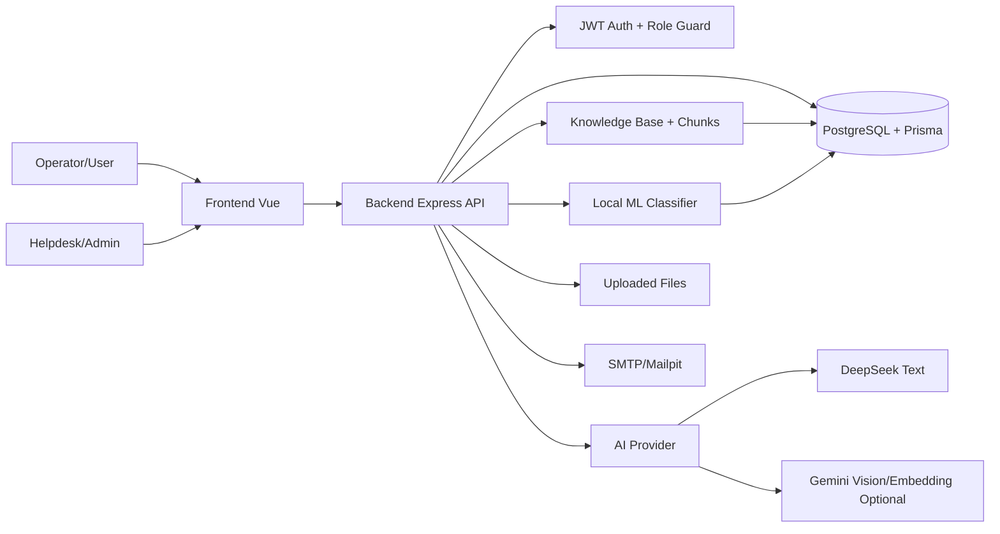
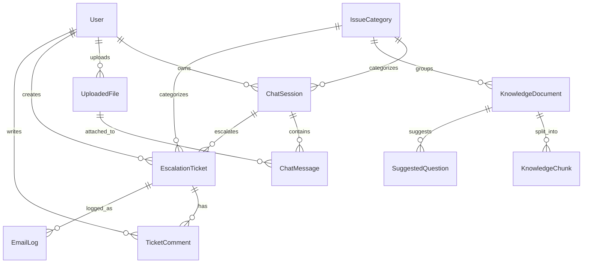
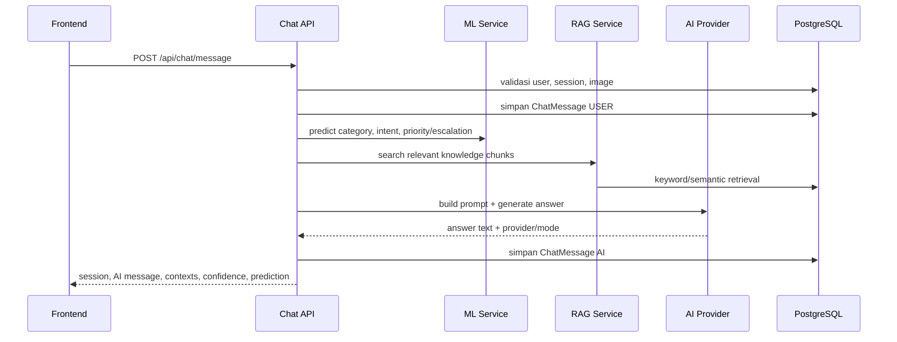
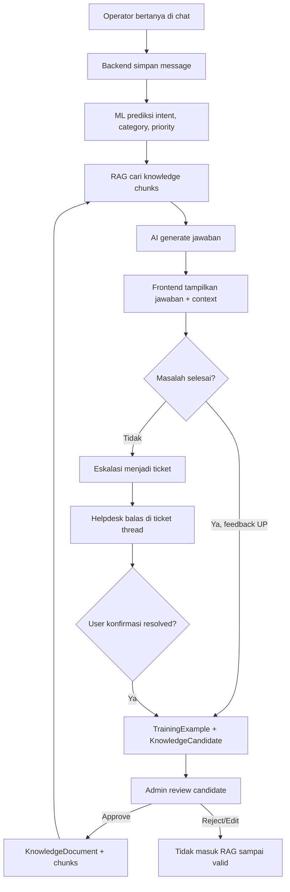

# Presentasi Teknis Epson AI Helpdesk

Sistem helpdesk internal berbasis AI, RAG, ticket escalation, dan self-learning terkontrol.

**Fokus presentasi:**

- Backend: API, database, auth, ticket, report, knowledge base.
- Frontend: Vue app, role-based UI, chat UX, admin/helpdesk pages.
- AI: RAG, prompt grounding, provider DeepSeek/Gemini, fallback aman.
- Machine Learning: klasifikasi lokal, prioritas, eskalasi, dan self-learning review.

Catatan presenter:
Gunakan presentasi ini untuk menjelaskan bagaimana aplikasi bekerja dari sisi user sampai ke database dan model AI/ML. Tekankan bahwa sistem tidak hanya chat AI, tetapi workflow helpdesk lengkap.

---

# 1. Gambaran Umum Produk

Epson AI Helpdesk adalah aplikasi internal untuk membantu operator menyelesaikan kendala perangkat Epson seperti printer, scanner, jaringan, firmware, hardware, dan part.

**Masalah yang diselesaikan:**

- Operator sering butuh panduan troubleshooting cepat.
- Helpdesk perlu konteks lengkap sebelum menangani eskalasi.
- Knowledge base perlu berkembang dari kasus nyata, tetapi tetap harus aman dan direview.
- Admin perlu melihat analytics, chat logs, ticket, akun, dan knowledge base.

**Solusi yang dibangun:**

- Chat AI troubleshooting.
- Retrieval-Augmented Generation dari knowledge base internal.
- Upload gambar defect.
- Eskalasi chat menjadi ticket.
- Thread balasan helpdesk dan operator.
- Email summary untuk arsip/notifikasi.
- ML lokal untuk kategori, intent, prioritas, dan rekomendasi eskalasi.
- Self-learning dengan approval manual.

---

# 2. Alur Besar Sistem



Catatan presenter:
Frontend hanya berkomunikasi ke backend melalui REST API. Backend menjadi pusat validasi, otorisasi, RAG, AI generation, penyimpanan data, upload file, ticket, dan email.

---

# 3. Tech Stack Utama

**Backend:**

- Node.js dengan Express 5.
- Prisma ORM.
- PostgreSQL.
- pgvector untuk embedding semantic RAG opsional.
- JWT untuk authentication.
- bcrypt untuk password hashing.
- Multer untuk upload gambar.
- Nodemailer untuk email report.
- Swagger UI untuk dokumentasi API.

**Frontend:**

- Vue 3.
- Vite.
- Pinia untuk state management.
- Vue Router untuk routing.
- Axios untuk API client.
- Font Awesome untuk icon.
- VueUse Motion untuk animasi UI.

**AI dan ML:**

- DeepSeek untuk jawaban teks/RAG.
- Gemini Vision untuk chat dengan gambar.
- Gemini embedding opsional untuk semantic RAG.
- Multinomial Naive Bayes lokal untuk klasifikasi.

---

# 4. Struktur Repository

```txt
AIEpsonHelpdesk/
  backend/
    prisma/
      schema.prisma
      migrations/
      seed.js
      backfill-embeddings.js
    src/
      app.js
      server.js
      config/
      middlewares/
      modules/
        ai/
        auth/
        chat/
        knowledge/
        ml/
        tickets/
        reports/
        admin/
        dashboard/
        files/
        users/
  frontend/
    src/
      main.js
      router/
      guards/
      stores/
      services/
      modules/
      components/
      assets/styles/
```

Catatan presenter:
Strukturnya modular. Backend dipisah berdasarkan domain bisnis, sedangkan frontend dipisah berdasarkan modules, services, stores, router, dan komponen.

---

# 5. Role dan Hak Akses

Sistem memiliki tiga role utama:

| Role | Fungsi Utama | Contoh Halaman |
|---|---|---|
| USER | Operator yang bertanya ke AI, upload gambar, membuat ticket, melihat ticket sendiri | `/chat`, `/dashboard`, `/tickets`, `/faq` |
| HELPDESK | Menangani ticket, melihat detail eskalasi, membalas operator, mengirim email report | `/helpdesk/tickets`, `/helpdesk/email-logs` |
| ADMIN | Mengelola akun, analytics, chat logs, knowledge base, kategori, ML, AI setting | `/admin/*` |

**Account approval:**

- Register operator selalu menghasilkan role `USER`.
- Status awal akun adalah `PENDING`.
- Admin harus mengubah status menjadi `ACTIVE`.
- Akun yang belum aktif diarahkan ke halaman pending approval.

---

# 6. Backend: Entry Point dan Middleware

Backend dimulai dari:

- `backend/src/server.js`
- `backend/src/app.js`

**Urutan penting di `app.js`:**

1. Membuat instance Express.
2. Mengaktifkan security middleware: Helmet, CORS, JSON parser.
3. Menyediakan Swagger docs di `/api/docs`.
4. Membuka endpoint public: health dan auth.
5. Semua route `/api/*` berikutnya wajib melewati `requireAuth`.
6. Setelah auth, akun juga harus aktif melalui `requireActiveAccount`.
7. Route role-based diproteksi dengan `authorizeRoles`.
8. Error ditangani oleh `notFound` dan `errorHandler`.

Catatan presenter:
Backend tidak membiarkan frontend menentukan hak akses sendiri. Walaupun frontend punya route guard, backend tetap melakukan validasi token, status akun, dan role.

---

# 7. Backend: Routing Utama

Endpoint utama yang tersedia:

| Modul | Prefix | Fungsi |
|---|---|---|
| Auth | `/api/auth` | Register, login, profile, logout, change password |
| Dashboard | `/api/dashboard` | Ringkasan user, popular issues, recent activity |
| Chat | `/api/chat` | Chat AI, history, session, feedback, regenerate |
| Files | `/api/files` | Upload dan akses gambar |
| Knowledge Public | `/api/knowledge` | FAQ/knowledge read-only |
| Tickets | `/api/tickets` | Eskalasi, ticket user, ticket helpdesk, comment, status |
| Reports | `/api/reports` | Summary dan email report |
| Email Logs | `/api/email-logs` | Riwayat email |
| Learning | `/api/learning` | Review self-learning candidates |
| Admin | `/api/admin` | Analytics, accounts, chat logs, AI settings |
| Admin Knowledge | `/api/admin/knowledge` | CRUD knowledge document |
| Admin ML | `/api/admin/ml` | Train/status/predict model ML |

---

# 8. Database dan Model Data

Database menggunakan PostgreSQL melalui Prisma.

**Model utama:**

- `User`: akun, role, status approval, preferences.
- `IssueCategory`: kategori masalah.
- `ChatSession`: sesi chat user dengan status `ACTIVE`, `RESOLVED`, atau `ESCALATED`.
- `ChatMessage`: pesan user/AI, confidence, provider, feedback, predicted category.
- `UploadedFile`: metadata gambar yang diupload.
- `KnowledgeDocument`: dokumen knowledge base.
- `KnowledgeChunk`: potongan dokumen untuk retrieval RAG.
- `SuggestedQuestion`: pertanyaan rekomendasi FAQ.
- `EscalationTicket`: ticket hasil eskalasi chat.
- `TicketComment`: thread balasan antara operator dan helpdesk.
- `EmailLog`: catatan pengiriman email.
- `MlModel`: model ML hasil training yang disimpan sebagai JSON.
- `TrainingExample`: contoh training tambahan dari feedback.
- `KnowledgeCandidate`: kandidat knowledge hasil self-learning yang menunggu review.
- `AppSetting`: setting aplikasi seperti mode AI.

---

# 9. Relasi Data Penting



Catatan presenter:
Data chat tidak berdiri sendiri. Chat bisa punya file, kategori, feedback, confidence, lalu bisa berubah menjadi ticket. Ticket masih menyimpan hubungan ke session agar helpdesk bisa melihat konteks lengkap.

---

# 10. Backend Auth dan Account Approval

**Register:**

- User mengisi employee ID, name, email, department, password.
- Backend validasi input dan duplikasi employee ID/email.
- Password di-hash dengan bcrypt.
- User dibuat dengan role `USER` dan status `PENDING`.
- Token JWT dibuat agar user bisa login, tetapi fitur utama tetap dikunci sampai akun aktif.

**Login:**

- Login bisa memakai employee ID atau email.
- Backend membandingkan password dengan hash.
- JWT berisi `sub`, `employeeId`, `role`, dan `accountStatus`.

**Route protection:**

- `requireAuth` memverifikasi Bearer token.
- `requireActiveAccount` memastikan status akun `ACTIVE`.
- `authorizeRoles` membatasi route admin/helpdesk.

---

# 11. Backend Chat Pipeline

Saat user mengirim pesan, backend menjalankan pipeline di `ChatService.sendMessage`.



Catatan presenter:
Yang penting adalah chat response bukan hanya call AI. Ada ML, retrieval knowledge base, prompt grounding, confidence scoring, persistence, dan return context ke frontend.

---

# 12. Chat Mode Normal dan Temporary

Sistem mendukung dua mode chat:

**Normal chat:**

- Session dan messages disimpan di database.
- Bisa muncul di history.
- Bisa diedit, regenerate, diberi feedback.
- Bisa dieskalasi menjadi ticket.
- Bisa menjadi sumber self-learning jika valid.

**Temporary chat:**

- Tidak membuat session permanen.
- Tidak menyimpan messages ke history.
- Tidak membuat ticket.
- Tidak masuk self-learning.
- Cocok untuk percobaan cepat atau pertanyaan yang tidak ingin disimpan.

Catatan presenter:
Temporary mode penting untuk privasi dan kontrol data. Sistem membedakan sejak backend, bukan hanya menyembunyikan dari UI.

---

# 13. Backend Ticket dan Helpdesk Flow

Ticket dibuat dari chat session melalui `/api/tickets/escalate`.

**Saat eskalasi:**

- Backend mengambil session, user, category, dan seluruh messages.
- ML memprediksi prioritas dari ringkasan percakapan.
- Sistem membuat `EscalationTicket`.
- Session diubah menjadi `ESCALATED`.
- Ticket diberi kode seperti `TKT-001`.

**Saat ditangani helpdesk:**

- Helpdesk/admin melihat queue ticket.
- Helpdesk membuka detail ticket berisi summary, history chat, file lampiran, dan thread komentar.
- Helpdesk membalas dari web.
- Status bisa berubah: `OPEN`, `IN_PROGRESS`, `RESOLVED`, `CLOSED`.
- Jika user mengonfirmasi solusi berhasil, ticket ditutup dan session menjadi resolved.

---

# 14. Backend Report dan Email

Modul reports memakai `ReportsService`.

**Fitur report:**

- Generate summary dari chat session atau ticket.
- Summary menggunakan utility `buildConversationSummary`.
- Jika chat punya gambar, gambar ikut dideteksi sebagai attachment metadata.
- Email dikirim dengan Nodemailer.
- Development menggunakan Mailpit.
- Hasil pengiriman disimpan ke `EmailLog`.

**Tujuan email:**

- Notifikasi.
- Arsip development/demo.
- Dokumentasi kasus untuk lead atau tim lain.

Catatan presenter:
Email bukan menggantikan thread ticket. Tindak lanjut resmi tetap terjadi di aplikasi lewat ticket comments.

---

# 15. Backend Knowledge Base

Knowledge base dikelola dari modul `knowledge`.

**Objek utama:**

- `KnowledgeDocument`: dokumen utama berisi title, source, content, category.
- `KnowledgeChunk`: potongan dokumen dengan panjang sekitar 900 karakter.
- `SuggestedQuestion`: pertanyaan rekomendasi untuk FAQ.

**Saat dokumen dibuat atau diupdate:**

1. Backend validasi title dan content.
2. Jika ada category, category dicek dulu.
3. Content dipecah menjadi beberapa chunk.
4. Chunk disimpan ke database.
5. Jika embedding aktif, setiap chunk dibuat embedding dan disimpan ke kolom vector.

Catatan presenter:
RAG mengambil context dari chunks, bukan dari satu dokumen panjang. Ini membuat pencarian lebih fokus.

---

# 16. Frontend: Arsitektur Umum

Frontend memakai Vue 3 dengan pola modular.

**Lapisan utama:**

- `router`: definisi route dan role page.
- `guards`: validasi auth dan role sebelum masuk halaman.
- `services`: wrapper API berbasis Axios.
- `stores`: state global memakai Pinia.
- `modules`: fitur per domain, seperti auth, chat, dashboard, tickets, admin.
- `components`: komponen reusable seperti layout, badge, modal.
- `assets/styles`: styling global, theme, chat, dashboard, ticket, landing.

**Entry point:**

- `frontend/src/main.js`
- `frontend/src/App.vue`

Catatan presenter:
Frontend tidak menaruh logic API langsung di view. View memanggil store/service agar state dan request lebih rapi.

---

# 17. Frontend Routing dan Guard

Routing utama ada di `frontend/src/router/index.js`.

**Public routes:**

- `/`: landing page.
- `/login`: login.
- `/register`: register operator.

**Authenticated routes:**

- `/chat`, `/chat/temp`, `/chat/:sessionId`.
- `/dashboard`.
- `/faq`.
- `/tickets`.
- `/helpdesk/tickets`.
- `/helpdesk/email-logs`.
- `/admin/*`.

**Guard behavior:**

- Jika token ada tetapi user belum terhydrate, frontend memanggil `/auth/me`.
- Jika token invalid, session lokal dibersihkan.
- User belum login diarahkan ke `/login`.
- Akun pending diarahkan ke `/pending-approval`.
- Role salah diarahkan ke `/forbidden`.
- User aktif yang membuka landing/login/register diarahkan ke default route sesuai role.

---

# 18. Frontend State Management

State global dikelola dengan Pinia.

**Store penting:**

- `auth.store.js`: token, user, login, register, logout, fetch profile.
- `chat.store.js`: chat history, current session, messages, contexts, sending/loading state.
- `dashboard.store.js`: data dashboard user.
- `ticket.store.js`: ticket user/helpdesk.
- `knowledge.store.js`: knowledge documents/categories.
- `preferences.store.js`: theme, default chat mode, compact sidebar.

**API client:**

- `services/api.js` memakai Axios.
- Base URL dari `VITE_API_URL`.
- Request interceptor menambahkan Bearer token.
- Response interceptor menangani `401` dengan clear token dan redirect login.

---

# 19. Frontend Chat UX

Chat UI berada di `frontend/src/modules/chat/views/ChatView.vue`.

**Fitur UX utama:**

- Empty state dengan suggested prompts.
- Optimistic user message saat mengirim.
- Typing indicator ketika AI sedang merespons.
- Upload gambar lewat composer.
- Related context panel untuk melihat knowledge chunks yang dipakai.
- Source note jika jawaban AI tidak grounded ke knowledge base.
- Feedback up/down untuk AI message.
- Edit user message dan regenerate AI answer.
- Escalation hint jika confidence rendah.
- Modal eskalasi untuk membuat ticket.
- Temporary mode banner.

Catatan presenter:
UI membantu user memahami kapan jawaban AI kuat dan kapan sebaiknya dieskalasi. Jadi AI tidak diposisikan sebagai jawaban mutlak.

---

# 20. Frontend Helpdesk dan Admin

**Helpdesk pages:**

- Queue ticket.
- Detail ticket.
- Summary percakapan.
- History chat read-only.
- Thread balasan ke operator.
- Email report.
- Email logs.

**Admin pages:**

- Analytics.
- Chat logs.
- Account approval.
- Knowledge documents.
- Categories.
- Learning candidates.
- AI settings.
- ML train/status/predict lewat endpoint admin.

Catatan presenter:
Helpdesk fokus pada operasional kasus, sedangkan admin fokus pada kontrol sistem, data, knowledge base, dan monitoring.

---

# 21. AI: Peran dalam Sistem

AI dipakai untuk:

- Menjawab pertanyaan troubleshooting.
- Menggunakan context knowledge base sebagai acuan.
- Membaca lampiran gambar melalui vision provider.
- Menghasilkan jawaban Bahasa Indonesia yang rapi dan aman.
- Menjaga jawaban tetap dalam domain perangkat Epson.
- Memberi panduan umum aman jika belum ada artikel knowledge base yang cocok.

**Boundary AI berada di backend:**

- `backend/src/modules/ai/rag.service.js`
- `backend/src/modules/ai/retrieval.service.js`
- `backend/src/modules/ai/prompt.service.js`
- `backend/src/modules/ai/generation.service.js`
- `backend/src/modules/ai/embedding.service.js`
- `backend/src/modules/ai/settings.service.js`
- `backend/src/modules/ai/providers/*`

---

# 22. AI Provider Saat Ini

Berdasarkan implementasi kode saat ini:

**Text/RAG:**

- Provider utama: DeepSeek.
- Model default: `deepseek-v4-flash`.
- Dipakai untuk chat teks tanpa gambar.

**Vision:**

- Provider: Gemini Vision.
- Dipakai ketika user mengirim gambar.

**Embedding:**

- Provider: Gemini embedding.
- Aktif hanya jika RAG mode bukan `keyword` dan `GEMINI_API_KEY` tersedia.
- Dimension default: 768.

**Fallback:**

- Jika provider gagal atau API key tidak tersedia, backend memakai mock answer yang tetap aman dan sesuai domain Epson.

---

# 23. Mode AI Hemat dan Normal

Setting AI disimpan di `AppSetting` dengan key `ai.deepseek`.

**Mode hemat:**

- Jawaban lebih ringkas.
- Token lebih kecil.
- Retry lebih rendah.
- Cocok untuk penggunaan harian.

**Mode normal:**

- Jawaban lebih lengkap.
- Token lebih besar.
- Retry lebih tinggi.
- Cocok untuk kasus teknis yang butuh konteks lebih panjang.

**Pemilihan provider:**

- Teks otomatis memakai DeepSeek.
- Gambar otomatis memakai Gemini Vision.
- UI/admin dapat membaca status provider dan mode lewat AI settings.

---

# 24. RAG: Retrieval-Augmented Generation

RAG membuat jawaban AI berbasis knowledge base internal.

**Alur RAG:**

1. User mengirim pesan.
2. Intent dicek: sapaan, helpdesk, atau luar topik.
3. Jika pertanyaan layak retrieval, backend mencari knowledge chunks.
4. Context yang relevan dimasukkan ke prompt.
5. AI menjawab berdasarkan context.
6. Frontend menampilkan related context dan source note.

**Kenapa RAG penting:**

- Jawaban lebih sesuai SOP internal.
- AI tidak hanya mengandalkan pengetahuan umum.
- Admin bisa memperbaiki jawaban dengan mengupdate knowledge base.

---

# 25. Retrieval Mode

Retrieval dilakukan di `retrieval.service.js`.

**Keyword mode, default saat ini:**

- Menggunakan PostgreSQL full-text search sederhana.
- Fallback ke pencarian `contains` jika query raw gagal.
- Jika query kosong atau tidak cocok, bisa mengambil chunk terbaru.
- Context tetap difilter dengan `IntentService.hasGroundedContext`.

**Semantic mode, opsional:**

- Query diubah menjadi embedding.
- Embedding dibandingkan dengan vector di `KnowledgeChunk`.
- Similarity dihitung dengan operator pgvector.
- Minimum similarity diatur oleh `RAG_MIN_SIMILARITY`.

**Hybrid mode, opsional:**

- Coba semantic terlebih dahulu.
- Jika tidak ada context grounded, fallback ke keyword.

---

# 26. Prompt Grounding dan Safety

Prompt dibuat oleh `PromptService.buildHelpdeskPrompt`.

**Instruksi utama ke AI:**

- Selalu jawab dalam Bahasa Indonesia.
- Gunakan format Markdown rapi.
- Berikan langkah troubleshooting bertahap.
- Ajukan maksimal 3 pertanyaan klarifikasi.
- Gunakan knowledge base sebagai rujukan utama.
- Jika tidak ada context, berikan panduan umum yang aman.
- Jangan mengarang kode error, spesifikasi, atau solusi teknis berisiko.
- Jika ada indikasi bahaya seperti asap, bau terbakar, kabel rusak, atau cairan masuk, minta user cabut daya dan eskalasi.

Catatan presenter:
Prompt bukan hanya "jawab pertanyaan". Prompt mengatur gaya, batasan domain, format, sumber, dan safety.

---

# 27. AI Confidence dan Grounding

Setelah AI menjawab, backend menghitung confidence.

**Sumber confidence:**

- Apakah provider live atau mock.
- Apakah ada context knowledge base.
- Score retrieval tertinggi.

**Dampak di frontend:**

- Jika `knowledgeGrounded` false, UI menampilkan catatan bahwa jawaban berupa panduan umum AI.
- Jika confidence rendah, UI menampilkan hint untuk eskalasi ke helpdesk.
- User tetap bisa feedback, regenerate, edit, atau membuat ticket.

Catatan presenter:
Confidence bukan akurasi absolut. Confidence dipakai sebagai sinyal UX untuk membantu user mengambil keputusan.

---

# 28. Machine Learning: Gambaran Umum

Machine learning berjalan lokal di backend, tanpa dependensi API eksternal.

**Tujuan ML:**

- Memprediksi kategori issue.
- Memprediksi intent pesan.
- Memprediksi prioritas.
- Menghitung kemungkinan eskalasi.
- Mengumpulkan training signal dari feedback dan resolved ticket.

**Model aktif:**

- Multinomial Naive Bayes.
- Training data = seed examples + examples dari database.
- Model disimpan ke tabel `MlModel` sebagai JSON.
- Model dicache di memory agar prediction cepat.
- Training dilakukan saat startup melalui `MlService.trainAll()`.

Catatan presenter:
ML di sini bukan LLM. Ini model klasifikasi ringan yang membantu workflow dan metadata, sementara jawaban natural language tetap dihasilkan oleh AI provider.

---

# 29. ML Task 1: Intent Classification

Intent classification menentukan jenis pesan user.

**Label intent:**

- `greeting`: sapaan seperti "hai", "halo", "selamat pagi".
- `helpdesk`: masalah perangkat Epson.
- `other`: pertanyaan di luar domain Epson.

**Penggunaan:**

- Jika greeting, AI menjawab ramah dan meminta user menjelaskan kendala.
- Jika helpdesk, retrieval dan troubleshooting berjalan.
- Jika other, AI diarahkan kembali ke domain Epson.
- Jika arithmetic sederhana, sistem bisa menjawab langsung tanpa retrieval.

Catatan presenter:
Intent classification mencegah sistem mencari knowledge base untuk sapaan atau pertanyaan yang tidak relevan.

---

# 30. ML Task 2: Category Classification

Category classifier memetakan pesan user ke kategori issue.

**Contoh label kategori dari seed:**

- `Print Quality Issue`
- `Scanner Error`
- `Network Issue`
- `Hardware Problem`
- `Firmware Problem`
- `Part Problem`

**Penggunaan:**

- Category prediction disimpan pada AI message.
- Jika confidence cukup, chat session otomatis diberi `categoryId`.
- Category membantu dashboard popular issues.
- Category membantu ticket dan analytics.
- Category membantu self-learning candidate masuk ke kategori yang benar.

---

# 31. ML Task 3: Priority dan Escalation

Priority classifier memprediksi urgensi kasus.

**Label priority:**

- `HIGH`: kasus kritikal, produksi berhenti, bahaya, total failure.
- `MEDIUM`: masalah mengganggu tetapi perangkat masih mungkin dipakai.
- `LOW`: pertanyaan ringan atau maintenance rutin.

**Escalation likelihood:**

- Menggabungkan predicted priority dan confidence AI.
- Jika priority tinggi atau confidence AI rendah, likelihood naik.
- Jika likelihood >= 0.7, sistem merekomendasikan eskalasi.

Catatan presenter:
Ini membantu helpdesk memprioritaskan kasus tanpa harus membaca semua chat dari awal.

---

# 32. ML Preprocessing dan Training

Preprocessing ada di `text.util.js`.

**Langkah preprocessing:**

- Lowercase.
- Menghapus karakter non alphanumeric.
- Tokenisasi berdasarkan spasi.
- Menghapus stopwords Bahasa Indonesia dan English.
- Light stemming sederhana untuk prefix/suffix umum.

**Training Naive Bayes:**

- Menghitung jumlah dokumen per label.
- Menghitung frekuensi kata per label.
- Membentuk vocabulary.
- Menggunakan Laplace smoothing agar token baru tidak membuat probabilitas nol.
- Prediction memakai log probability.
- Confidence dihitung dengan softmax dari log scores.

Catatan presenter:
Implementasi aktif memakai token frequency dan Multinomial Naive Bayes. File util juga menyediakan helper TF-IDF, tetapi classifier utama saat ini tidak bergantung pada library ML eksternal.

---

# 33. ML Model Store

Model disimpan di tabel `MlModel`.

**Data yang disimpan:**

- `name`: nama model, misalnya `category-classifier`.
- `version`: naik setiap retrain.
- `payload`: parameter model dalam JSON.
- `metrics`: hasil evaluasi seperti accuracy.
- `trainedAt`: waktu training.
- `sampleCount`: jumlah sample training.

**Keuntungan:**

- Model tidak hilang saat server restart.
- Prediction bisa memakai model tersimpan.
- Admin bisa melihat status model.
- Model dicache agar tidak query database setiap request.

---

# 34. Self-Learning yang Aman

Self-learning tidak langsung mengubah knowledge base.

**Sinyal learning:**

- Feedback positif pada jawaban AI.
- Ticket resolved atau closed.
- Session yang valid dan bukan temporary.

**Yang terjadi:**

1. Sistem dapat menambah `TrainingExample` untuk classifier.
2. Sistem membuat `KnowledgeCandidate` status `PENDING`.
3. Konten kandidat mengalami redaction sederhana untuk email, phone, token, password, secret, dan API key.
4. Admin/helpdesk mereview candidate.
5. Jika approved, candidate menjadi `KnowledgeDocument`.
6. Dokumen baru dipecah menjadi chunks untuk RAG.

Catatan presenter:
Ini penting untuk governance. Sistem belajar dari kasus nyata, tetapi knowledge base tidak otomatis berubah tanpa manusia.

---

# 35. End-to-End Flow: Dari Pertanyaan ke Knowledge Baru



Catatan presenter:
Siklus ini menunjukkan nilai utama sistem: semakin banyak kasus valid, semakin baik knowledge base, tetapi tetap dikontrol oleh admin.

---

# 36. Frontend dan Backend Integration

**Contoh integrasi chat:**

- Frontend `chat.store.js` memanggil `chat.service.js`.
- `chat.service.js` mengirim request ke `/chat/message`.
- Axios interceptor menambahkan JWT.
- Backend memproses pipeline AI/ML/RAG.
- Response berisi:
  - session
  - userMessage
  - aiMessage
  - contexts
  - provider
  - aiMode
  - prediction
- Store menyimpan messages dan contexts.
- View menampilkan bubble chat, context panel, confidence behavior, dan tombol eskalasi.

Catatan presenter:
Respons backend dirancang agar frontend tidak perlu menebak. Data provider, mode, context, dan confidence sudah dikirim.

---

# 37. Keamanan dan Kontrol Akses

**Backend security:**

- JWT Bearer token.
- Password hashing bcrypt.
- Role authorization.
- Active account middleware.
- CORS origin whitelist.
- Helmet security headers.
- Upload file hanya image melalui flow file service/middleware.
- User biasa hanya bisa mengakses file, chat, dan ticket miliknya.

**Frontend security UX:**

- Route guard sesuai role.
- Token invalid otomatis redirect login.
- Pending account diarahkan ke pending approval.
- UI admin/helpdesk tidak ditampilkan ke user biasa.

Catatan presenter:
Frontend guard bagus untuk UX, tetapi keamanan utama tetap di backend.

---

# 38. Observability dan Analytics

Admin analytics menghitung:

- Total sessions.
- Total user queries.
- Total escalations.
- Average AI response time.
- Resolution rate.
- Deflection rate, yaitu session resolved tanpa eskalasi.
- Top issues dari gabungan chat session dan escalation ticket.

Dashboard user menampilkan:

- Quick actions.
- Popular issues dalam window 30 hari.
- Recent activity.

Catatan presenter:
Analytics membantu admin melihat apakah AI benar-benar mengurangi beban helpdesk dan kategori masalah apa yang paling sering muncul.

---

# 39. Kekuatan Sistem

**Kekuatan teknis:**

- Modular backend dan frontend.
- Role-based access jelas.
- RAG terhubung ke knowledge base internal.
- Fallback AI aman saat provider gagal.
- Local ML ringan dan tidak butuh service tambahan.
- Ticket flow lengkap dari chat sampai resolved.
- Self-learning aman karena harus direview.
- UI menampilkan context dan status grounding.

**Kekuatan untuk bisnis:**

- Operator mendapat jawaban cepat.
- Helpdesk menerima ticket dengan konteks lengkap.
- Knowledge base berkembang dari kasus nyata.
- Admin punya kontrol dan analytics.

---

# 40. Batasan dan Ruang Pengembangan

**Batasan saat ini:**

- Semantic RAG butuh embedding aktif dan data sudah dibackfill.
- Jika API key provider kosong atau quota habis, sistem memakai fallback mock.
- Confidence adalah sinyal heuristik, bukan pengukuran kebenaran absolut.
- Self-learning tetap membutuhkan review manual agar aman.

**Pengembangan berikutnya:**

- Logging internal untuk kegagalan provider AI.
- Evaluasi kualitas RAG dengan dataset pertanyaan uji.
- Dashboard performa model ML lebih lengkap.
- Audit trail untuk perubahan knowledge base.
- Integrasi SMTP production.
- Fine-tuning retraining workflow untuk data training yang lebih besar.

---

# 41. Demo Flow yang Disarankan

1. Buka landing page.
2. Login sebagai operator aktif.
3. Masuk ke chat dan kirim pertanyaan: "Hasil cetak bergaris setelah maintenance."
4. Tunjukkan AI answer, related context, provider/mode, dan source note jika ada.
5. Upload gambar defect dan kirim pertanyaan tambahan.
6. Buat eskalasi ticket.
7. Login sebagai helpdesk/admin.
8. Buka queue ticket dan detail ticket.
9. Tunjukkan summary, chat history, comment thread, dan email report.
10. Resolve ticket.
11. Masuk admin learning candidates.
12. Approve candidate agar menjadi knowledge document.
13. Tunjukkan bahwa knowledge baru bisa dipakai RAG berikutnya.

---

# 42. File Kode yang Bisa Ditunjukkan Saat Presentasi

**Backend:**

- `backend/src/app.js`: middleware dan route mounting.
- `backend/src/server.js`: startup dan training ML.
- `backend/prisma/schema.prisma`: database model.
- `backend/src/modules/chat/chat.service.js`: pipeline chat.
- `backend/src/modules/ai/rag.service.js`: orchestration RAG.
- `backend/src/modules/ai/retrieval.service.js`: keyword/semantic retrieval.
- `backend/src/modules/ai/prompt.service.js`: prompt grounding.
- `backend/src/modules/ai/generation.service.js`: AI provider dan fallback.
- `backend/src/modules/ml/ml.service.js`: training dan prediction ML.
- `backend/src/modules/ml/naive-bayes.js`: algoritma classifier.
- `backend/src/modules/ml/learning.service.js`: self-learning candidate.
- `backend/src/modules/tickets/tickets.service.js`: eskalasi dan ticket flow.
- `backend/src/modules/knowledge/knowledge.service.js`: knowledge chunking.

**Frontend:**

- `frontend/src/router/index.js`: route dan role.
- `frontend/src/guards/auth.guard.js`: auth guard.
- `frontend/src/services/api.js`: Axios client.
- `frontend/src/stores/auth.store.js`: session state.
- `frontend/src/stores/chat.store.js`: chat state.
- `frontend/src/modules/chat/views/ChatView.vue`: chat page.
- `frontend/src/modules/admin/views/*`: admin pages.
- `frontend/src/modules/tickets/views/*`: ticket pages.

---

# 43. Ringkasan Akhir

Epson AI Helpdesk adalah sistem helpdesk end-to-end, bukan sekadar chatbot.

**Backend** menangani API, auth, database, ticket, knowledge base, report, email, AI, dan ML.

**Frontend** menyediakan pengalaman operator, helpdesk, dan admin dengan route guard, state management, chat UX, ticket workflow, dan admin tools.

**AI** memakai RAG agar jawaban mengacu ke knowledge base internal, dengan prompt safety dan fallback aman.

**Machine Learning** berjalan lokal untuk membantu klasifikasi intent, kategori, prioritas, eskalasi, dan self-learning yang tetap dikontrol manusia.

Kesimpulan utama:
Sistem ini mempercepat troubleshooting, memperkaya konteks eskalasi, dan membuat knowledge base berkembang secara aman dari kasus nyata.

